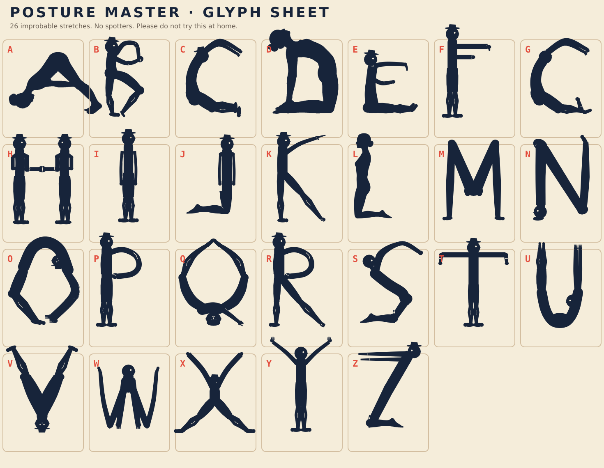

# Posture Master



A comic display font in which **single bodies contort into letterforms**. Every capital is a traced silhouette from a modern gymnast or yoga photograph, chosen for readable letter topology and natural limb proportions.

## Quick start

Copy `posture-master.css`, `posture-master.woff2`, and `posture-master.woff` into the same directory, then link the stylesheet:

```html
<link rel="stylesheet" href="posture-master.css">
<h1 class="posture-master">BENDY TYPE!</h1>
```

Or declare only the compact WOFF2:

```css
@font-face {
  font-family: "Posture Master";
  src: url("posture-master.woff2") format("woff2");
  font-display: swap;
}
```

## Included files

- [`posture-master.woff2`](posture-master.woff2) — preferred modern web font
- [`posture-master.woff`](posture-master.woff) — legacy web-font fallback
- [`posture-master.ttf`](posture-master.ttf) — desktop/installable font
- [`posture-master.css`](posture-master.css) — ready-to-use `@font-face` declaration
- [`glyph-sheet.svg`](glyph-sheet.svg) — A–Z visual overview
- [`generate_font.py`](generate_font.py) — builds the TTF/WOFF/WOFF2 files and [`glyph-sheet.svg`](glyph-sheet.svg)
- [`trace_silhouette.py`](trace_silhouette.py) — OpenCV tracer for A–Z except L
- [`outline_points/`](outline_points/) — A–Z traced contours consumed by the generator
- [`assets/silhouettes/`](assets/silhouettes/) — source rasters for those contours
- [`assets/`](assets/) `*_gymnast_photo.png` — photographic sources for B, C, D, F, H, J, O, P, Q, R, S, U, V, W, X, Y, and Z
- [`n_poster_crop.png`](assets/n_poster_crop.png) — enlarged 2 Way Stretch N cell
- [`two-way-stretch-alphabet.jpg`](assets/two-way-stretch-alphabet.jpg) — the poster that crop came from

## Character coverage

- A–Z
- space

## How a letter is built

Each capital lives as [`outline_points/`](outline_points/)`{a–z}.py`, exporting `OUTLINE_POINTS` and `HOLES`. Matching rasters sit in [`assets/silhouettes/`](assets/silhouettes/).

Two tracers produced those contours:

- **[`trace_silhouette.py`](trace_silhouette.py)** (A–Z except L) — Otsu-threshold the raster, keep the largest component, scale the longest side to 480 with a 16px margin, take the OpenCV exterior contour, and resample it to about 3px. Points sit in that canonical 480-box, so a tall letter’s first point is near `y=16`.
- **[VTracer 0.6.12](https://github.com/visioncortex/vtracer)** (L only) — fitted cubics to [`l.png`](assets/silhouettes/l.png) and wrote [`l.svg`](assets/silhouettes/l.svg). That spline was flattened to a polyline in the original 768×1376 image space, so L’s steps vary and its coordinates are not padded to 16.

Both paths end as the same kind of polygon. [`generate_font.py`](generate_font.py) imports `LETTERS` from the package, scales each contour uniformly to cap height 788, seats it on `BAR_GROUND` (y=72), and gives every glyph 72 units of sidebearing. Advances are proportional and uncapped, so wide poses such as V, W, and Q can exceed the em.

Rebuild with:

```bash
python generate_font.py
```

## Letter notes

| | Source | Pose |
| --- | --- | --- |
| **A** | [`silhouettes/a.png`](assets/silhouettes/a.png) | Standing wide-legged forward fold: lifted hips the apex, spread legs the diagonals, folded torso and arms the crossbar. |
| **B** | [`b_gymnast_photo.png`](assets/b_gymnast_photo.png) | From behind: standing leg and torso the stem, hand-on-hip elbow the upper bowl, bent knee the lower bowl. |
| **C** | [`c_gymnast_photo.png`](assets/c_gymnast_photo.png) | Kneeling backbend, thighs the left stem, arched torso and thrown-back head opening right. |
| **D** | [`d_gymnast_photo.png`](assets/d_gymnast_photo.png), [`silhouettes/d.png`](assets/silhouettes/d.png) | Kneeling camel: thighs the stem, thrown-back head the top of the bowl, hands on the heels. The import is mirrored to face the conventional D. |
| **E** | [`silhouettes/e.png`](assets/silhouettes/e.png) | Kneeling: upright spine the stem, raised arm the top bar, forward arm the middle bar, folded legs the bottom bar. |
| **F** | [`f_gymnast_photo.png`](assets/f_gymnast_photo.png) | Standing on one straight leg; both arms the top bar; folded lifted leg the middle bar. |
| **G** | [`silhouettes/g.png`](assets/silhouettes/g.png) | Seated: spine curled into a C as the bowl, knees drawn up to close the lower right, arms arcing overhead with the hands as the spur. |
| **H** | [`h_gymnast_photo.png`](assets/h_gymnast_photo.png) | Horizontal torso the crossbar; raised leg and kneeling shin the left stem; raised and planted arms the right stem. |
| **I** | [`silhouettes/i.png`](assets/silhouettes/i.png) | Legs pressed together the stem; crossed arms and open hands the top serif; feet turned out the bottom serif. |
| **J** | [`j_gymnast_photo.png`](assets/j_gymnast_photo.png) | Joined legs the tall right stem, flexed feet a short top serif, hips/back/arms the open bottom hook, upright profile head the lower-left terminal. |
| **K** | [`silhouettes/k.png`](assets/silhouettes/k.png) | Kneeling upright torso the stem, raised arm the upper diagonal, extended straight leg the lower diagonal. |
| **L** | [`silhouettes/l.png`](assets/silhouettes/l.png), [`silhouettes/l.svg`](assets/silhouettes/l.svg) | High-kneeling side profile: vertical trunk the stem, shin and pointed foot the bottom bar. |
| **M** | [`silhouettes/m.png`](assets/silhouettes/m.png) | Folded double from behind: raised knees the peaks, calves the outer stems, thighs sloping in to hanging hips the central V. |
| **N** | [`n_poster_crop.png`](assets/n_poster_crop.png) | Planted arm the left stem, organic torso the diagonal, raised leg the right stem. |
| **O** | [`o_gymnast_photo.png`](assets/o_gymnast_photo.png) | Full bow whose raised feet and grasping arms close a ring, with a large natural counter. |
| **P** | [`p_gymnast_photo.png`](assets/p_gymnast_photo.png) | Standing backbend: planted legs the stem; arched torso, hanging head, and clasped hands the bowl. |
| **Q** | [`q_gymnast_photo.png`](assets/q_gymnast_photo.png) | Prone bow: raised feet and grasping arm close the ring; the other arm plants as the tail. |
| **R** | [`r_gymnast_photo.png`](assets/r_gymnast_photo.png) | The same standing backbend as P, with the front leg stepped forward as the diagonal. |
| **S** | [`s_gymnast_photo.png`](assets/s_gymnast_photo.png) | Grounded shins the lower terminal, backbend and head the middle curve, overlapped arms the upper hook. |
| **T** | [`silhouettes/t.png`](assets/silhouettes/t.png) | Standing from behind: legs together the stem, both arms level with the shoulders the bar. |
| **U** | [`u_gymnast_photo.png`](assets/u_gymnast_photo.png), [`silhouettes/u.png`](assets/silhouettes/u.png) | Arms the left stem with an inward hand serif, hips the bowl, joined legs the right stem to pointed feet; profile head on the left stem, counter left open. |
| **V** | [`v_gymnast_photo.png`](assets/v_gymnast_photo.png) | Two equal legs rise from a compact buttocks apex; outward-turned shod feet are the upper terminals. |
| **W** | [`w_gymnast_photo.png`](assets/w_gymnast_photo.png) | Head and shoulders the centre peak, arms overlapping thighs as inner strokes, shorter slimmer calves as outer strokes. Hands conceal the grounded knees; pointed feet turn modestly outward. One contour, no carved notch. |
| **X** | [`x_gymnast_photo.png`](assets/x_gymnast_photo.png) | Wide forward fold from behind: legs an inverted V, head hanging at the centre, arms to the upper corners. |
| **Y** | [`y_gymnast_photo.png`](assets/y_gymnast_photo.png) | Headstand: torso the stem, split legs the V. |
| **Z** | [`z_gymnast_photo.png`](assets/z_gymnast_photo.png), [`silhouettes/z.png`](assets/silhouettes/z.png) | Kneeling: both arms the top bar, leaning torso and thighs the diagonal, shins and feet the bottom bar. |
